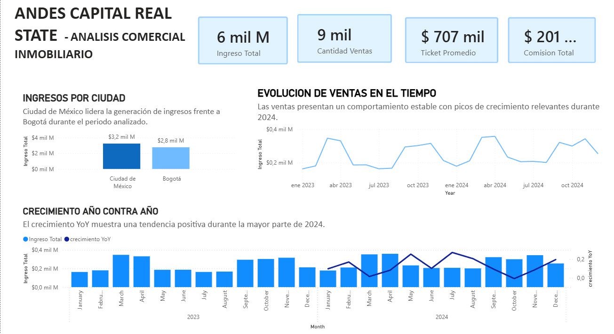
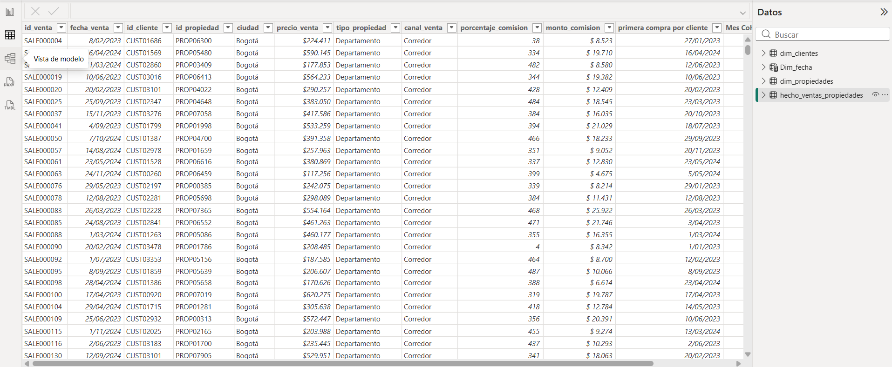
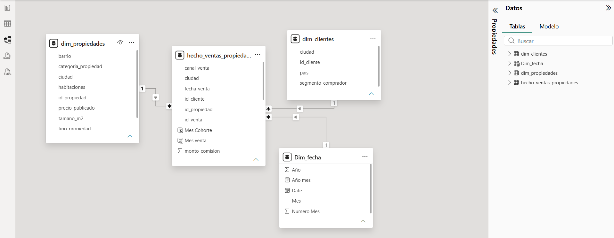
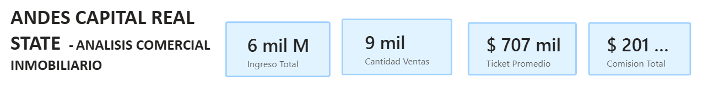
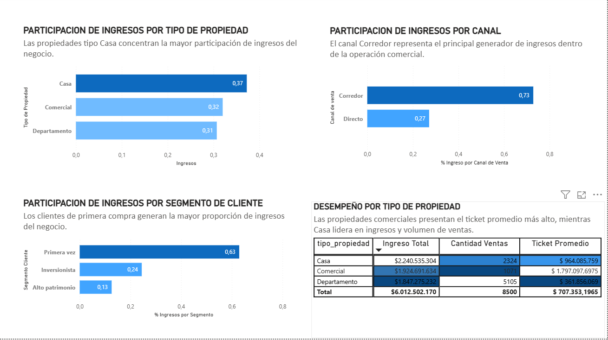
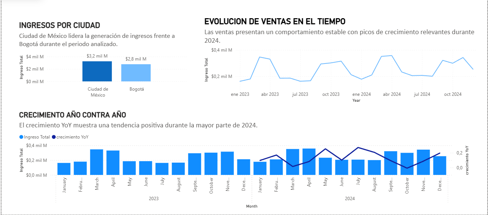
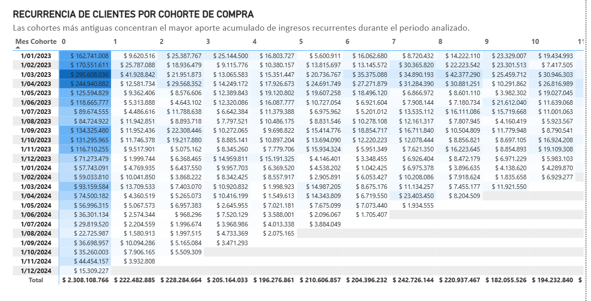

# jessicaflorez2.github.io

🏢 Andes Capital Real Estate: Dashboard de análisis comercial inmobiliario

🎯**Desafío**

La empresa inmobiliaria Andes Capital necesitaba transformar datos transaccionales en información estratégica para comprender mejor el desempeño comercial de sus operaciones.

El reto consistía en responder preguntas clave relacionadas con ventas, clientes, propiedades y crecimiento del negocio:

¿Qué propiedades generan más ingresos?
¿Qué segmentos de clientes compran más?
¿Cómo evolucionan las ventas en el tiempo?
¿El negocio está creciendo año tras año?
¿Los clientes regresan después de su primera compra?

**Proceso**

Desarrollé un dashboard interactivo en Power BI para centralizar el análisis comercial y facilitar la toma de decisiones basada en datos.

Preparación y validación de datos
Revisión de tipos de datos, valores nulos y duplicados.
Estandarización de tablas de ventas, clientes y propiedades.
Preparación de datos para modelado analítico.

🧹**Modelado de datos**
Construcción de un modelo en esquema estrella.
Creación de relaciones entre tabla de hechos y dimensiones.
Desarrollo de una tabla calendario para análisis temporal.

**Desarrollo de métricas comerciales**

Creación de indicadores para evaluar el desempeño del negocio:

Ingresos totales
Número de propiedades vendidas
Comisión generada
Ticket promedio

💰**Análisis comercial**
Evaluación de ventas por tipo de propiedad.
Comparación de desempeño por canal comercial.
Identificación de segmentos de clientes más valiosos.
Análisis geográfico de ventas.

📅**Análisis temporal**
Evolución de ventas mes a mes.
Comparaciones año contra año.
Identificación de tendencias de crecimiento.

👥**Análisis de recurrencia**
Construcción de cohortes de clientes.
Evaluación de recompra y fidelización.
Identificación de patrones de retención.

📈**Resultado**

El dashboard permitió consolidar la información comercial en una única herramienta de análisis, facilitando la identificación de oportunidades de crecimiento y segmentos estratégicos.

Entre los principales resultados:

Identificación de los tipos de propiedad con mayor contribución a ingresos.
Detección de los segmentos de clientes más rentables.
Monitoreo del crecimiento comercial mediante indicadores temporales.
Visualización de patrones de recompra para apoyar estrategias de fidelización.

🛠️**Herramientas utilizadas**
Power BI
DAX
Power Query
Modelado dimensional
Esquema estrella
Inteligencia de tiempo
Análisis de cohortes
Visualización de datos

